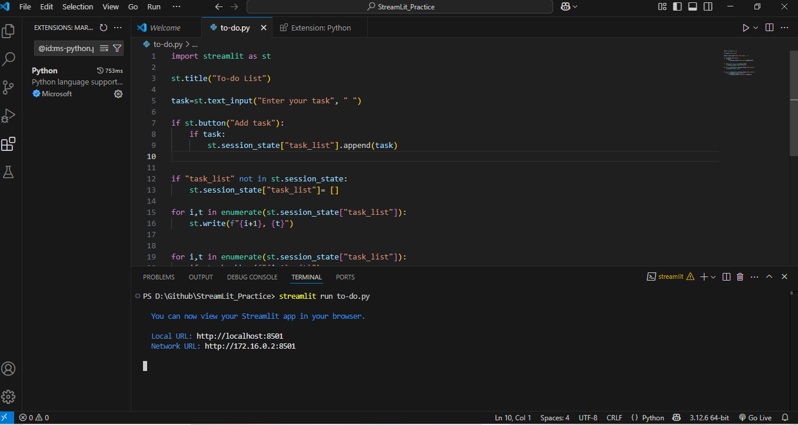
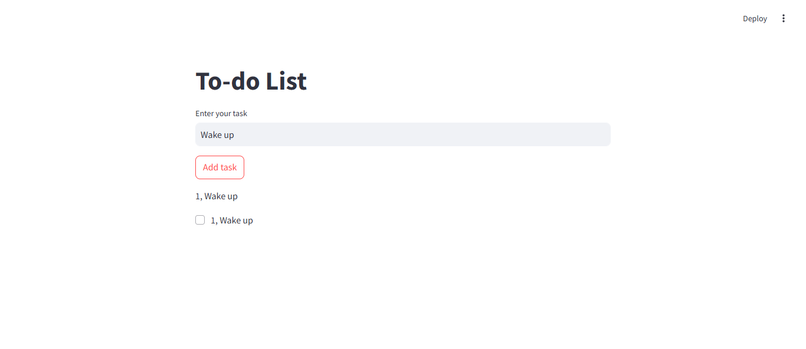

# 📋 Streamlit To-Do List

A simple **To-Do List** web app built using **Streamlit**. This app allows users to add and remove tasks dynamically using Streamlit's session state.

## 🚀 Features
- Add tasks to the list 📌
- View all tasks in an ordered list 📜
- Remove completed tasks ✅
- Uses **Streamlit session state** for state management

## 🖼 Screenshots



## 📦 Installation & Usage
1. Clone the repository:
   ```sh
   git clone https://github.com/your-username/your-repo-name.git
